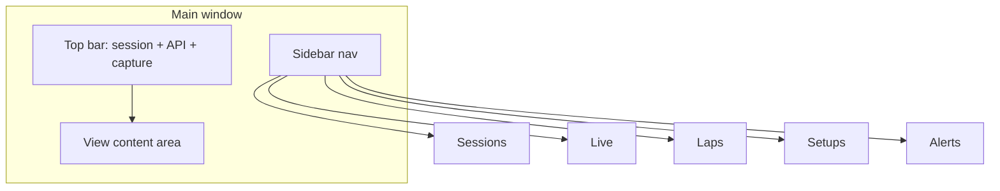
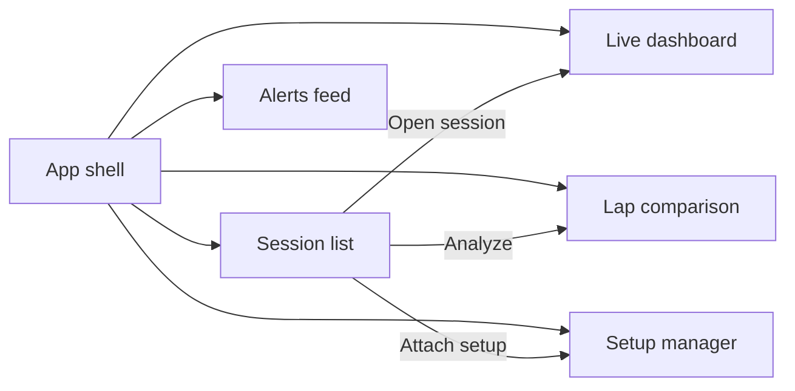
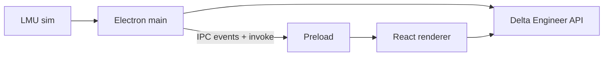

# Delta Engineer — Electron UI architecture & wireframes

> **Status:** Design specification for Milestone 7 (issue #23). Implementation follows in #24+.
> **Stack:** Electron + React, `electron-builder` (NSIS), API as a separate process.

---

## 1. Goals and principles

- **Desktop-first, Windows primary** — Same machine as LMU; dense layouts are acceptable; avoid tiny touch targets.
- **Glanceable while driving** — Large numerics for speed, gear, critical temps; minimal chrome in “live” mode; optional compact vs comfortable density toggle later.
- **Motorsport clarity, distinct identity** — Take inspiration from professional telemetry tools (e.g. Coach Dave Delta–style information density and grouping) without copying branding, colors, or layout verbatim. Prefer a neutral dark theme with one accent color and clear typography hierarchy.
- **Accessibility** — Sufficient contrast for text and alarms; visible focus rings for keyboard navigation; don’t rely on color alone for severity (icons or labels).
- **Separation of concerns** — Renderer talks to the API over HTTP(S); privileged LMU capture and OS integration stay in **main** + **preload** (see §6).

---

## 2. Application shell

### 2.1 Layout

- **Left sidebar (primary nav)** — Fixed width (~240px); icons + labels for five main views; optional collapse to icons-only.
- **Top bar (context)** — Current **session** name or “No session”; **API** connection pill (`GET /health`); **LMU / capture** status (from main process, not HTTP); global **errors** toast area or inline banner.
- **Content area** — Router outlet for the active view.

### 2.2 Status and settings

- **API base URL** — User setting (e.g. `http://127.0.0.1:8000`); stored locally; health polled periodically when the window is focused.
- **Capture pipeline** — Main process owns shared-memory / UDP reader; renderer sees state via IPC (`capture:status` — connected, Hz, last error).
- **Tray** — Align with product decision: minimize-to-tray on close (default on); tray menu: Show window, Start/stop capture (optional), Quit.



---

## 3. Information architecture & navigation

| Route / view        | Purpose |
|---------------------|---------|
| `/sessions`         | Browse and manage sessions |
| `/live`             | Live telemetry dashboard for active capture |
| `/laps`             | Lap list and comparison |
| `/setups`           | Setup library and correlation |
| `/alerts`           | Alert feed and (later) rule hints |



---

## 4. Per-view wireframes (conceptual)

Wireframes are **structural** (regions and widgets), not pixel-perfect mocks.

### 4.1 Session list (`/sessions`)

**Regions**

- **Toolbar** — Search, filters (track, session type, date range), “New session” → `POST /sessions`, refresh.
- **Main** — Table or card grid: track, car, driver, type, started, duration, frame count (from `GET /sessions/{id}` when expanded or from list if enriched), status (active / ended).
- **Row actions** — Open in Live, Open in Laps, End session → `PATCH /sessions/{id}` with `ended_at`.

**Data**

- `GET /sessions` (paginated, filters)
- `PATCH /sessions/{id}` to end
- `POST /sessions` to create manually if needed

---

### 4.2 Live telemetry dashboard (`/live`)

**Regions**

- **Header** — Active session selector (from list or “follow capture session”); post rate / buffer depth indicator.
- **Primary strip** — Speed (large), gear, RPM, lap + sector, optional delta (when laps API exists).
- **Inputs** — Throttle, brake, steering (bar or strip chart).
- **Vehicle** — Tire temps / pressures (4 corners), fuel, optional wear placeholders.
- **Trends** — Small sparklines or last-N-second charts for chosen channels (renderer holds rolling buffer from capture IPC + confirmed posts).

**Data sources**

- **Today:** Decoded frames from **main process** (IPC) for low-latency display; batches sent to API via `POST /telemetry` (same process orchestration in main or a dedicated helper).
- **API:** `GET /health` for service availability; `GET /sessions/{id}` for metadata and frame counts; optional occasional poll—not for 50 Hz data path.
- **Future:** If the API adds a WebSocket or stream for replay, the dashboard can subscribe; until then, **live UI is driven by local capture**, API is persistence and analysis.

---

### 4.3 Lap comparison (`/laps`)

**Regions**

- **Session scope** — Pick session → `GET /sessions/{id}`.
- **Lap picker** — Multi-select laps → `GET /sessions/{id}/laps` (paginated / filterable as needed).
- **Compute** — Button or auto-run after ingest → `POST /sessions/{id}/laps/compute` when summaries are stale or missing.
- **Chart** — Time or distance on X, selected channels overlaid; delta plot when comparing two laps → `GET /laps/compare?ids=A,B`.
- **Sector table** — S1/S2/S3 times and deltas (from comparison payload or lap summary fields).

**Data**

- `GET /sessions/{id}/laps`, `POST /sessions/{id}/laps/compute`, `GET /laps/compare` — **implemented** (API Milestone 3)

---

### 4.4 Setup manager (`/setups`)

**Regions**

- **List** — Filter by car / track; `GET /setups` (planned).
- **Detail** — Named setup, metadata, notes, link to session(s).
- **Actions** — Upload file or form → `POST /setups` (planned); “Correlate with session” → `GET /setups/correlate` (planned).

**Data (planned)**

- `POST /setups`, `GET /setups`, `GET /setups/correlate` — Milestone 4

---

### 4.5 Alerts feed (`/alerts`)

**Regions**

- **Feed** — Chronological list: severity, rule name, message, session link, timestamp → `GET /alerts` (planned).
- **Live** — When `WS /ws/alerts` exists, subscribe and prepend; until then, **poll** `GET /alerts` on an interval (e.g. 5–10s) with backoff when disconnected.
- **Rules (read-only at first)** — Link or subpanel to `GET /alerts/rules` (planned); authoring via `POST /alerts/rules` can be a later screen.

**Data (planned)**

- `GET /alerts`, `GET /alerts/rules`, `WS /ws/alerts` — Milestone 5

---

## 5. E3N boundary

- **This app** — Capture, persistence client, engineering UI (numbers, laps, setups, alerts). No embedded chat or Anthropic calls.
- **E3N** — All natural-language and strategy AI. Integration is **one-way export** of structured summaries: future `POST /ingest` from this client or from the API after a session ends.
- **UX hook** — Single primary action, e.g. “Send session summary to E3N” (enabled when `/ingest` and E3N URL/config exist). Optional deep link to open E3N with a session id—only if that protocol is defined later.

---

## 6. Electron process architecture

- **Main** — `BrowserWindow`, system tray, lifecycle, **LMU capture** (native / Node addon or child process), batching and `POST /telemetry`, periodic `GET /health` optional (or leave to renderer).
- **Preload** — `contextBridge.exposeInMainWorld` with a narrow, typed API; **no** raw `ipcRenderer` in renderer.
- **Renderer** — React + router; `fetch` to Delta Engineer API; receives telemetry **samples** via bridged events for UI only (not for re-parsing binary in renderer).

**Security defaults**

- `nodeIntegration: false`, `contextIsolation: true`, sandbox enabled.
- Validate all IPC payloads in main (shape + version).



### 6.1 IPC channels (by concern)

| Area | Direction | Example channel / method | Notes |
|------|-----------|---------------------------|--------|
| Config | R ↔ M | `config:get`, `config:set` | API base URL, theme, tray preference |
| Capture | M → R | `capture:frame` (throttled) | Decoded dict or binary handle + metadata; throttle to UI budget (e.g. 20–30 Hz display) |
| Capture | R → M | `capture:start`, `capture:stop` | User control |
| Capture | M → R | `capture:status` | Connected, Hz, errors |
| Telemetry POST | M (internal) | — | Main or worker posts batches to `POST /telemetry` |
| Window | R → M | `window:minimize-to-tray` | Tray behavior |

Exact names can be prefixed (`delta:`) to avoid collisions. Prefer `invoke`/`handle` for RPC-style calls and `on` for streaming status.

---

## 7. React component map (high level)

```
App
├── AppShell (sidebar + top bar + outlet)
├── providers (QueryClient, Router, Theme)
├── pages/
│   ├── SessionListPage
│   ├── LiveDashboardPage
│   ├── LapComparisonPage
│   ├── SetupManagerPage
│   └── AlertsFeedPage
└── components/
    ├── SessionCard | SessionTable
    ├── TelemetryStrip (speed, gear, rpm)
    ├── InputBars (throttle, brake, steering)
    ├── TireGrid
    ├── LapChart (wrapper over chart lib)
    ├── SectorTable
    ├── SetupForm | SetupList
    ├── AlertListItem
    └── ConnectionStatus (API + capture)
```

**State**

- **Server state** — TanStack Query (or similar) for REST: sessions, session detail, future laps/setups/alerts.
- **Live buffer** — React state or lightweight store updated from `capture:frame` IPC (not duplicated in Query cache at 50 Hz).
- **UI state** — Router, modals, selected laps, filters — colocated or small Zustand slice if needed.

---

## 8. View → API matrix

| View | Endpoint | Status |
|------|----------|--------|
| All | `GET /health` | Done |
| Session list | `GET /sessions` | Done |
| Session list | `POST /sessions` | Done |
| Session list | `PATCH /sessions/{id}` | Done |
| Live / context | `GET /sessions/{id}` | Done |
| Live ingest | `POST /telemetry` | Done (called from main/worker) |
| Laps | `GET /sessions/{id}/laps` | Done |
| Laps | `POST /sessions/{id}/laps/compute` | Done |
| Laps | `GET /laps/compare` | Done |
| Setups | `POST /setups`, `GET /setups` | Planned |
| Setups | `GET /setups/correlate` | Planned |
| Alerts | `GET /alerts`, `GET /alerts/rules` | Planned |
| Alerts | `WS /ws/alerts` | Planned |
| E3N handoff | `POST /ingest` | Planned |

---

## 9. Implementation handoff (#24)

1. Scaffold Electron + Vite + React + TypeScript in a `client/` or `electron-app/` directory (exact name TBD in #24).
2. Implement preload bridge and typed `window.delta` (or equivalent) matching §6.
3. Stub pages matching §7; wire Session list + health first; Live second; others behind empty states until APIs land.

---

## References

- [README.md](../README.md) — Endpoint table and architecture diagram
- [CLAUDE.md](../CLAUDE.md) — Project decisions and milestone status
- [docs/telemetry-format.md](./telemetry-format.md) — LMU / rF2 telemetry fields (informs Live dashboard channels)
